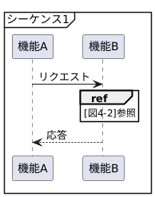
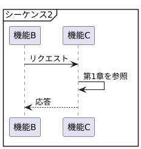
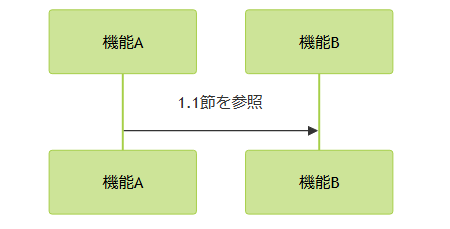

# pandoc_crossref_filterによる相互参照のサンプル

## 1. 自動でセクション番号が付与されます

### 1.1. 自動でセクション番号が付与されます

#### 1.1.1. 自動でセクション番号が付与されます

##### 1.1.1.1. 自動でセクション番号が付与されます

## .unを付与すると、章番号を付与しません

セクション番号の参照ができます。

- [第1章](#sec-sec1)
- [1.1節](#sec-sec2)
- [1.1.1項](#sec-sec3)
- [1.1.1.1目](#sec-sec4)

## 1.1-A) ヘッダーの中でもセクション番号を参照できます

## 2. 図番号の参照

[\[図2-1\]](#fig-fig1)を参照します。

  
\[図2-1\] 図番号の参照のサンプルです

## 3. 表番号の参照

[\[表3-1\]](#tbl-tbl1)を参照します。

<table>
<caption>[表3-1] 表番号の参照のサンプルです</caption>
<colgroup>
<col style="width: 50%" />
<col style="width: 50%" />
</colgroup>
<thead>
<tr>
<th style="text-align: left;">列A</th>
<th style="text-align: left;">列B</th>
</tr>
</thead>
<tbody>
<tr>
<td style="text-align: left;">テスト</td>
<td style="text-align: left;">です</td>
</tr>
<tr>
<td style="text-align: left;"><code>&lt;br&gt;</code>を使うと、表の中も改行できます(Word変換にも対応。)</td>
<td style="text-align: left;">・改行 
・される 
</td>
</tr>
<tr>
<td style="text-align: left;">表の中でも参照が使えます</td>
<td style="text-align: left;"><a href="#sec-sec1">第1章</a>, <a href="#fig-fig1">[図2-1]</a></td>
</tr>
</tbody>
</table>

## 4. PlantUMLの相互参照

特殊な記法ですが、plantumlで作成した図も相互参照できます。

  
\[図4-1\] 処理Xのシーケンス図

  

  
\[図4-2\] 処理Xの詳細

  

[\[図4-3\]](#fig-test_mermaid)は、Mermaidで作成しています。

  
\[図4-3\] Mermaidのテスト
